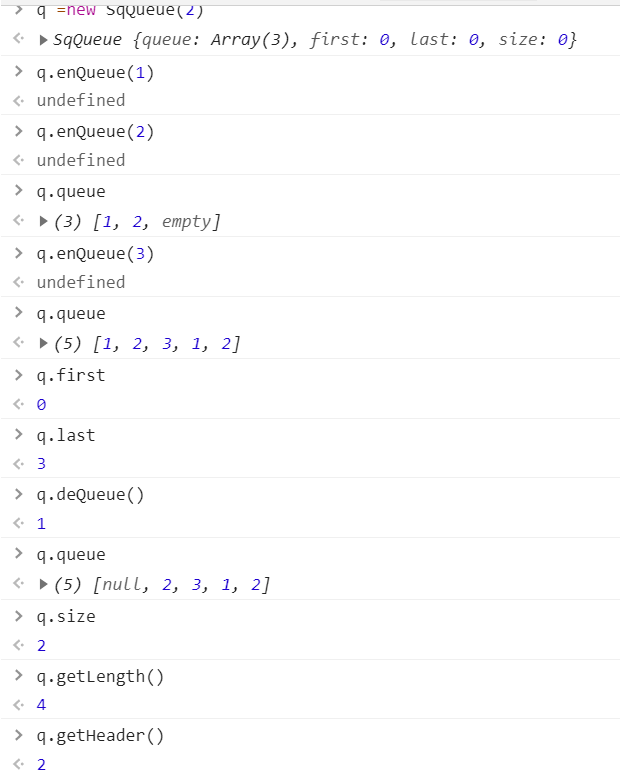
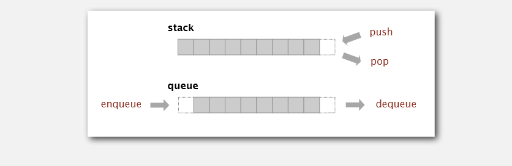

## 栈

栈是一个**线性**的数据结构。栈最重要的特征是**只允许从一端操作数据**。栈就像一叠书，或者盘子，每次只能从最上边拿，往最上边放。栈在编程中的应用场景有执行栈等。

栈遵循**先进后出**的原则。栈只能从一端操作数据，这一端被称为**栈顶**，另一端被称为**栈底**。栈对数据的操作只有两种，**入栈和出栈**。

看到这里我们就能知道，由于入栈和出栈都在栈顶操作，所以插入或删除一个元素的复杂度为O(1)。

特殊情况下，当栈满的时候，再添加一个元素时，需要重新分配内存且移动所有的数据，复杂度为O(n)。

实现一个栈有很多方式，这里通过使用数组实现栈，代码实现：

``` js
class Stack{
  constructor{
    this.stack = []
  }

  // 入栈
  push(item) {
    this.stack.push(item)
  }

  // 出栈
  pop() {
    this.stack.pop()
  }

  // 获取栈长度
  getCount() {
    return this.stack.length
  }

  // 查看栈顶元素
  peek() {
    return this.stack[this.getCount() - 1]
  }

  // 判断是否为空
  isEmpty() {
    return this.getCount === 0
  }
}
```

栈的示意图：


## 队列

队列也是一个线性的存储结构，特点是**只能在一端添加数据，在另一端删除数据**，遵循**先进先出**的原则。

队列**插入数据的一端叫做队尾**，插入数据的操作叫**入队**；**删除数据的一端叫做队头**，删除数据的操作叫做**出队**。

队列的时间复杂度和栈一样分是否已满，当队列未满时，入队复杂度是O(1)，出队移除一个数据，剩下的数据前移，所以时间复杂度是O(n)；当队列满了之后，需要扩容且移动数据，时间复杂度为O(n)。

队列在生活中的相似场景为，车站的进出口，只能在进站口进站，出站口出站。队列常见的使用场景是作消息队列等。

我们还是用数组来实现一个单链队列，代码实现如下：

``` js
class Queue{
  constructor() {
    this.queue = []
  }
  
  // 入队
  enQueue(item) {
    return this.queue.push(item)
  }
    
  // 出队
  deQueue() {
    return this.queue.shift()
  }
    
  // 获取队头
  getHeader() {
    return this.queue[0]
  }
    
  // 获取队列长度
  getlength() {
    return this.queue.length()
  }
    
  // 判断是否为空
  isEmpty() {
    return this.getlength() === 0
  }
}
```

为了解决单链队列在出队操作时的复杂度是O(n)，引入循环队列，将队列的出队操作复杂度降低到O(1)。

``` js
class SqQueue{
  constructor(length){
    this.queue = new Array(length + 1)
    this.first = 0
    this.last = 0
    this.size = 0
  }
    
  // 判断是否为空
  isEmpty() {
    return this.first === this.last
  }
  
  // 扩容
  resize(length) {
    let q = new Array(length)
    for (let i = 0; i < length; i++) {
      q[i] = this.queue[(i + this.first) % this.queue.length]
    }
    this.queue = q
    this.first = 0
    this.last = this.size
  }
    
  // 入队
  enQueue(item) {
    // 判断是否需要扩容， 如果需要，扩容的原来的二倍
    if (this.first === (this.last + 1) % this.queue.length) {
      this.resize(this.getLength() * 2 + 1)
    }
    this.queue[this.last] = item
    this.size++
    this.last = (this.last + 1) % this.queue.length
  }
    
  // 出队
  deQueue() {
    if (this.isEmpty()) {
      throw Eorror('Queue is Empty')
    }
    let r = this.queue[this.first]
    this.queue[this.first] = null
    this.first = (this.first + 1) % this.queue.length
    this.size--
    // 节省空间
    if (this.size === this.getLength() / 4 && this.getLength() / 2 !== 0) {
      this.resize(this.getLength() / 2)
    }
    return r
  }
    
  // 获取队头
  getHeader() {
    if (this.inEmpty()) {
      throw Error('Queue is empty')
    }
    return this.queue[this.first]
  }
    
  // 获取队列的长度
  getLength() {
    return this.queue.length - 1
  }
}
```

创建一个循环队列并操作：



## 对比



对比：

- 栈遵循先进后出的规则；队列遵循先进先出的规则。
- 插入数据和删除数据都可以实现常数级的时间复杂度。
- 两种数据结构都可以在元素满了的时候扩容。

## 栈和队列相关的面试题

由于篇幅的问题，面试题的思路和代码还是留给以后的文章。

跟栈相关的面试题：

- 有效的括号，一串字符串中的所有括号`(){}[]`，都能正确闭合。
- 用两个栈实现队列。
- 实现一个栈，要求入栈出栈、返回最小值，且时间复杂度为O(1)。
- 一个数组实现两个栈。

跟队列相关的面试题：

- 用两个队列实现栈。
- 二叉树的广度优先遍历。
- ...

