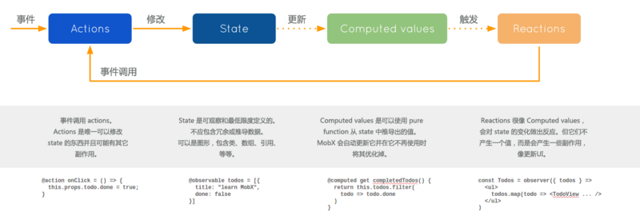

## MobX三大要点

1、定义状态并使其可观察

2、创建视图以响应状态的变化

3、更改状态

## 概念与原则

1、State状态

**状态**是驱动应用的数据。通常像有待办事项列表这样的**领域特定状态**，还有像当前已选元素的视**图状态**。**状态就像是有数据的Excel表。**

2、Derivation衍生

**任何**源自**状态**并且不会再有任何进一步的相互作用的东西就是衍生。衍生以多种形式存在：

- 用户界面
- 衍生数据，比如剩下的待办事项的数量。
- 后端集成，

MobX区分了两种类型的衍生：

- Computed values（计算值）-它们是永远使用纯函数从当前可观察状态中衍生出的值。
- Reactions（反应）-Reactions是当前状态

3、Actions

**动作**是任意一段可以改变**状态**的代码。用户事件、后端数据发送、预定事件等等。动作类似于用户在excel单元格中插入一个新的值。

4、原则

MobX支持单向数据流，也就是**动作**改变**状态**，而状态的改变会更新所有受影响的**视图**。

当状态改变时，所有衍生都会进行**原子级的自动更新**。因此永远不可能观察到中间值。

所有**衍生**默认都是**同步**更新，这意味着**动作**可以在改变**状态**之后直接可以安全的检查计算值。

**计算值** 是**延迟**更新的。任何不在使用状态的计算值将不会更新，直到需要它进行副作用（I / O）操作时。 如果视图不再使用，那么它会自动被垃圾回收。

所有的**计算值**都应该是**纯净**的。它们不应该用来改变**状态**。

## MobX工作流程



## 快速上手

1、**observable**

observable是一种让数据的变化可以被观察的方法，底层是通过把该属性转化成getter/setter。

Observable 值可以是**JS基本数据类型、引用类型、普通对象、类实例、数组和映射**。

observable使用：

- 对于JS基本数据类型(Number/String/Boolean)，使用observable.box()方法设置；
- 对于数组、对象类型，使用observable()方法设置；
- 对于映射类型，使用observable.map()方法设置；
- 装饰器@observable可以直接定义这些类型。

2、响应observable

2.1、**(@)computed**

计算值(computed values)是可以根据现有的状态或其它计算值衍生出的值。计算值还是高度优化过的，它们有助于使实际可修改的状态尽可能的小。

计算值是**相关状态变化时自动更新的值**，可以**将多个可观察数据合并成一个可观察数据**，**且只有在被使用时才会自动更新**。

computed使用：

- 使用@computed声明式创建；
- 使用decorate引入；
- 使用observable.object创建。

2.2、**autorun**

`autorun`就是自动运行的意思。当使用`autorun`时，所提供的函数总是立即被触发一次，然后每次它的依赖关系发生改变时会再次触发。

computed和autorun对比：

**相同点：**都是响应式调用的表达式。

**不同点：**

- @computed用于响应式的产生一个可以被其他observable使用的**值**，autorun不产生新的值，而是产生一个**效果**。
- @computed中，如果一个计算值不再被观察了，MobX可以自动地将其**垃圾回收**；而autorun必须手动清理。

2.3、**when**

``` js
when(predicate: () => boolean, effect?: () => void, options?)
```

`when`接收两个函数参数，第一个函数`preidcate`**根据可观察数据返回一个布尔值**。如果返回true，`effect`就会被执行，然后autorun自动运行函数就会被清理。

如果没有提供`effect`函数，`when`会返回一个`Promise`。可以与`async/await`完美结合。

2.4、**reaction**

```js
reaction(() => data, (data, reaction) => { sideEffect }, options?)
```

`reaction`接收两个函数参数，返回一个**清理函数**。

第一个函数参数**引用可观察数据，返回一个可观察数据**data，作为第二个函数的参数。

创建reaction函数时，不会直接运行，只有当数据表达式首次返回一个新值后才会运行。在执行reaction函数时访问的任何observable都不会被追踪。

第二个函数参数接收两个参数（副作用函数），一个参数是之前返回的data，另一是reaction，用于清理reaction。

3、**修改observable**

3.1、**(@)action**

`action`是用来修改状态的东西。应该永远只对**修改**状态的函数使用动作。 只执行查找，过滤器等函数**不**应该被标记为动作，以允许 MobX 跟踪它们的调用。

`(@)action.bound`可以用来**自动地将动作绑定到目标对象**。与action不同的是，`(@)action.bound`不需要一个name参数，名称将始终基于动作绑定的属性。

action可以分批操作状态，一次动作中包含多次修改可观察状态。在动作完成之后，会做一次性的重新计算和反应。

3.2、**async actions**

`runInAction`是一个简单的工具函数，接收代码块在异步动作中执行。`runInAction(f)` 实际上是 `action(f)()` 的语法糖。

## 总结

- 使用`(@)observable`设置可观察数据
- 使用`(@)computed/autorun/when/reaction`对可观察数据做出响应
  - `computed`可以将多个可观察数据组合成一个可观察数据；
  - `autorun`自动追踪可观察数据，在数据发生改变时自动执行；
  - `when`设置自动触发变化的实际，是`autorun`的一个变种情况；
  - `reaction`分离可观察数据，以副作用的方式对`autorun`进行改进
- 使用`(@)action`修改可观察数据，且有编写异步代码的几种方式
  - `Promises`
  - `runInAction`
  - `async/await`
  - flows

**MobX与Redux相比：**

- Redux的编程范式是函数式的；而MobX是面向对象的。

- Redux的数据理想上是immutable的，每次都返回一个新的数据，因此Redux是支持数据回溯的；而MobX始终都是一份引用。
- Redux使用dispatch进行广播，通过Provider和connect来对比前后差别控制更新粒度；MobX的observable控制的更加精细。