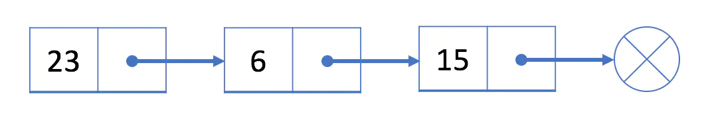
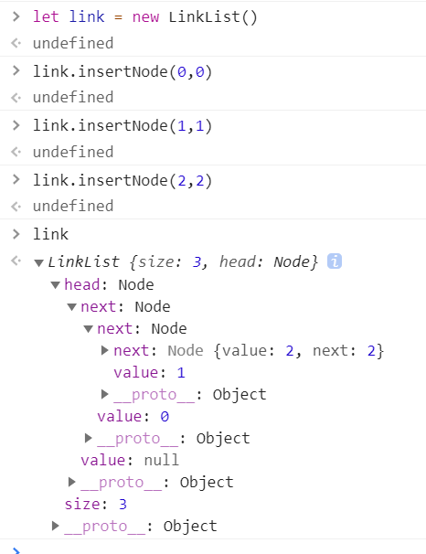
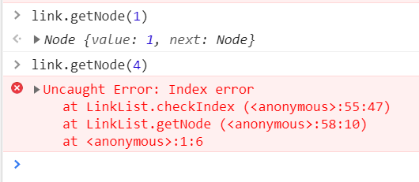
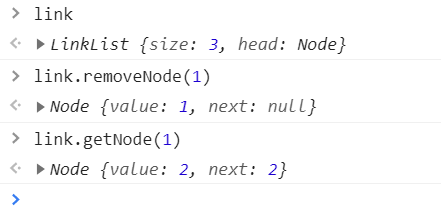

## 什么是链表

链表是一个**线性**结构，充分利用了计算机的内存空间，实现了灵活的内存状态管理。在物理存储结构上，链表是不连续、无顺序的存储结构，在逻辑上，通过使用节点的引用实现顺序。

链表是由一个个**节点**组成，每个节点有两部分组成：**数据和引用**。数据部分存放数据，引用部分指向下一个节点。大致结构如下所示：



这是最简单最基础的链表，还有其他形式的链表：

- 单向或双向
- 是否有头
- 是否循环
- 

## 代码实现

因为链表的结构很简单，我们可以自己写代码手动实现一个单向链表，代码如下：

``` js
// 构造一个节点
class Node {
  constructor(v, next){
    this.value = v;
    this.next = next;
  }
}

class LinkList {
  constructor(){
    // 链表的属性，长度和头部
    this.size = 0
    this.head = new Node(null, null)
  }
    
  // 是否为空
  isEmpty() {
    return this.size === 0
  }
  
  // 获取长度
  getSize() {
    return this.size
  }
   
  // 查找
  find(header, index, currentIndex){
    if(index === currentIndex) return header
    return this.find(header.next, index, currentIndex + 1)
  }
    
  // 检查index合法
  checkIndex(index){
    if (index < 0 || index > this.size) throw Error('index error')
  }
    
  // 获取节点
  getNode(index) {
    this.checkIndex(index)
    if (this.isEmpty()) return
    return this.find(this.head, index, 0).next
  }
    
  // 添加节点
  addNode(v, index) {
    this.checkIndex(index)
    // 首先循环到最后一个节点，然后插入节点
    let prev = this.find(this.head, index, 0)
    prev.next = new Node(v, index)
    this.size++
    return prev.next
  }
    
  // 插入节点
  insertNode(v, index){
    this.addNode(v, index)
  }
  // 头部插入节点
  insertToFirst(v, index) {
    this.addNode(v, 0)
  }
  // 尾部插入节点
  insertToLast(v, index) {
    this.addNode(v, this.size)
  }
    
  // 删除一个节点
  removeNode(index, isLast) {
    this.checkIndex(index)
    // isLast是一个布尔值，判断是否最后一个节点
    // 删除index后的节点后，将index后的第二个节点接在index节点后
    index = isLast ? index - 1 : index
    let prev = this.find(this.head, index, 0)
    let node = prev.next
    prev.next = node.next
    node.next = null
    this.size--
    return node
  }
    
  //删除头节点和尾节点
  removeFirst() {
    return this.removeNode(0)
  }
    
  removeLast() {
    return this.removeNode(this.size, true)
  }
}
```

创建一个链表并插入节点：



查询：



删除：



## 复杂度分析

链表相对于数组来说，**失去了随机读取的优点，同时增加了节点的指针域**。

我们自己用代码实现一个链表时，可以发现增加和删除操作，都需要递归找到目标节点。数组可以通过下标直接访问到元素，所以链表的时间复杂度一般是要大于数组的。

我们可以做一个表格对比平均复杂度。

| 操作 | 数组 | 链表 |
| :--: | :--: | :--: |
| 访问 | O(1) | O(n) |
| 插入 | O(1) | O(n) |
| 删除 | O(n) | O(n) |
| 修改 | O(1) | O(n) |

数组的操作是指空间充足且一般的查找方式。

复杂度有**最好和最坏情况的复杂度**，分别为在最理想和最不理想的情况下，执行这段代码的时间复杂度。

而**平均复杂度**是指**用代码在所有情况下执行的次数的加权平均值表示的复杂度**，一般时间复杂度分析都是指平均复杂度。除此之外还有一个**均摊复杂度**。

对于链表的插入操作来讲，在头的这一方插入时间复杂度为O(1)，在尾部插入的时间复杂度是O(n)，在中间插入的时间复杂度是O(n/2)，当常数忽略以后就是O(n)。

## 其他链表

上边将的是单向链表，**只能向一个方向递归**，就像小学生站队，后边的人把手臂伸直搭在前边同学的肩膀上。

除了单向链表还有双向链表，**每个节点分别有两个指针，分别指向前驱结点和后继节点**，就像小朋友们手拉手。

还有循环链表，就是链表中的最后一个节点又指向第一个节点，构成一个环。

有序链表，是链表中节点的value按升序或降序排列。

## 链表相关的面试题

常见的链表相关的面试题大概如下，由于篇幅问题，具体的实现思路及代码，再写新的文章。

1、合并两个有序链表。

2、打印两个链表的公共值（两个链表的第一个公共节点）。

3、链表的分化，给定一个值value，小于value的放在前边，大于value的放在后边。

4、链表的k逆序。

5、链表是否为回文链表。

6、判断一个链表中是否有环。

7、查找单链表中倒数第k个节点的值。

8、反转单链表。

9、从尾到头打印链表。

10、复杂链表的复制。

11、...


